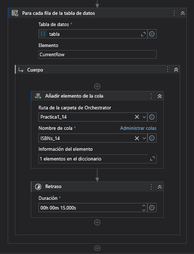

# Manual de Usuario  
#### Universidad de San Carlos de Guatemala  
#### Facultad de Ingeniería  
#### Inteligencia Artificial 1  

## Práctica 1   
### Biblioteca Central  

#### Nombre y carnet 
- Yeinny Melissa Catalán de León   - 202004725  
- Luis Angel Barrera Velásquez     - 202010223 

Guatemala, Junio 2024.  
___
  
## Introducción  
___
Este manual técnico ha sido elaborado como parte del curso de Inteligencia Artificial 1 en la Universidad San Carlos de Guatemala, Facultad de Ingeniería, Escuela de Ciencias y Sistemas. El propósito de este documento es proporcionar una guía detallada sobre la implementación y funcionamiento de una solución de Automatización Robótica de Procesos (RPA) utilizando UiPath Studio y su Orquestador. Esta práctica se centra en la automatización del registro de libros en la Biblioteca Central mediante el uso del Número Estándar Internacional de Libros (ISBN).
  
# Instrucciones del Proceso de lectura de ISBN’s

 

## Obtener Activo: urlExcel
- **Ruta de la carpeta de Orchestrator**: Practica1_14
- **Nombre del activo**: urlExcel
- **Descripción**: Esta actividad obtiene la URL del archivo Excel que contiene los ISBNs. El activo se almacena en el Orchestrator bajo la carpeta Practica1_14.

## Obtener Activo: urlSalida
- **Ruta de la carpeta de Orchestrator**: Practica1_14
- **Nombre del activo**: urlSalida
- **Descripción**: Esta actividad obtiene la URL del archivo Excel donde se guardarán los resultados. Este activo también se encuentra en la carpeta Practica1_14 del Orchestrator.

## Obtener Activo: rango
- **Ruta de la carpeta de Orchestrator**: Practica1_14
- **Nombre del activo**: rango
- **Descripción**: Esta actividad obtiene el rango de celdas del archivo Excel que se debe leer. Al igual que los anteriores, este activo está en la carpeta Practica1_14.

## Invocar Código
- **Código Invocado**: `Array.ForEach(Directory.GetFiles(path), Sub(f) File.Delete(f))`
- **Descripción**: Esta actividad invoca un fragmento de código que elimina todos los archivos en el directorio especificado por la variable `path`. Esto asegura que no haya archivos antiguos en el directorio antes de que el proceso comience a guardar nuevos archivos.

## Proceso de Excel
 

Configuramos un alcance de proceso de Excel y luego usamos la actividad de UiPath de usar un Excel en el cual utilizamos el `urlExcel` configurado anteriormente para que de esta forma guardemos esa referencia como los ISBNs, ya que esta contiene los números ISBN de los libros que se utilizarán. Adicionalmente, se lee el rango especificado donde están los ISBNs y se guarda en una tabla de UiPath.

 

Después de tener la tabla guardada con los valores de los ISBNs, iteramos esa tabla recorriendo cada uno de los números y en cada iteración guardamos ese número en una variable que se usará en la actividad de "Añadir elemento de la cola", en la cual lo que hace es añadir ese número a la cola especificada en la carpeta y con el nombre de la cola en específico. Luego, se le especifica el valor de este mismo, el cual es el valor `CurrentRow` de la iteración actual sobre la tabla. Por último, se da un tiempo de retraso de 15 segundos entre cada iteración.

# Instrucciones del Proceso de búsqueda de ISBN’s

 

Al igual que en el proceso anterior definimos algunos Assets que apuntan al orquestador y tambien se invoca una porcion de codigo para hacer el vaciado de la carpeta raiz.

 

Despues de esto invocamos el proceso de obtener los ISBN de la cola del orquestador y con esto ya empezamos con el proceso.

 

añadimos las columnas que fueron solicitadas en la practica como el ISBN, title, price, etc.

 

despues de esto entramos a la pagina e iteramos por cada elemento de la cola.

 

Ahora se procede a buscar cada uno de los ISBNs que estan en la cola de manera iterativa lo que para esto se utilizan las actividades de UiPath que aparecen en la imagen, despues de esto iniciamos la comprobacion de Full Title para verificar que el libro exista.

 

en caso que aparezca el titulo se procede a guardarlo en sus respectivas variables para poder empezar con el proceso de verificacion de precio. Que practicamente es muy similar el proceso.

 

En caso no aparezca se guarda el error.

 

Al final de cada iteracion se procede a dar un tiempo de retraso de 20 segundos tal y como lo indica la practica.