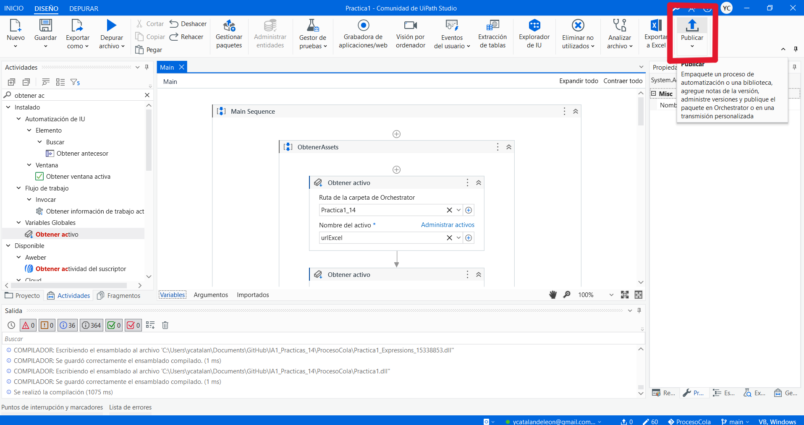
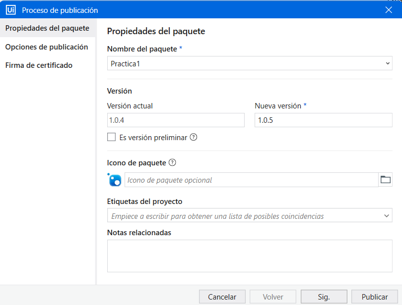
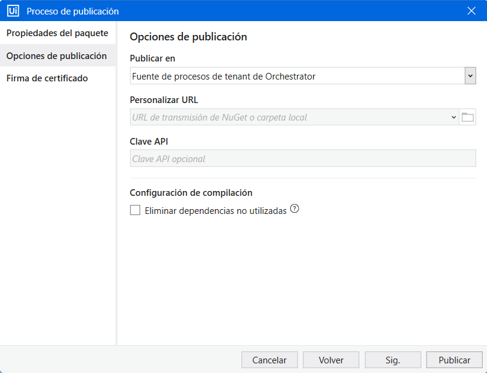
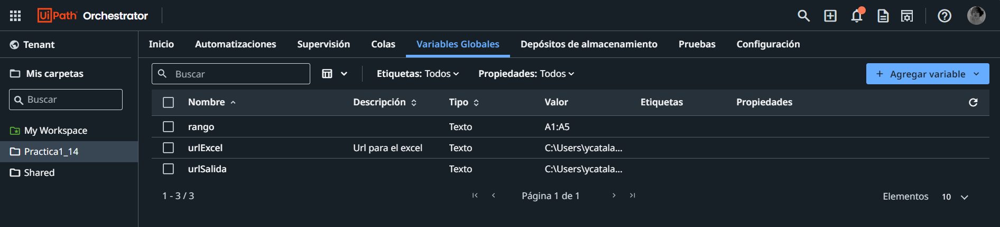
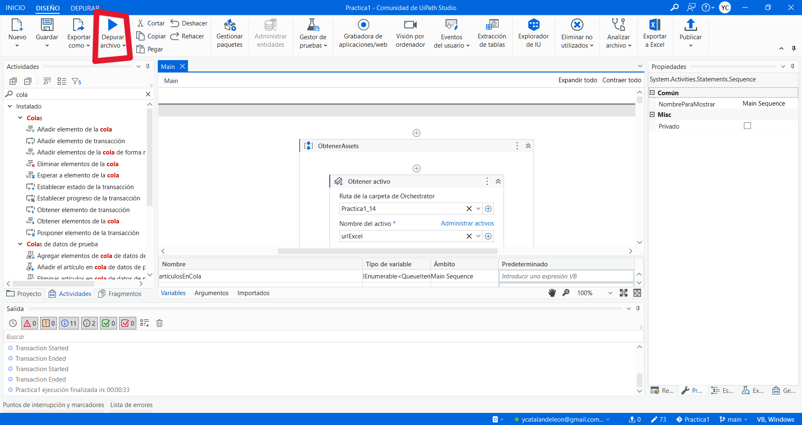

# Manual de Usuario  
#### Universidad de San Carlos de Guatemala  
#### Facultad de Ingeniería  
#### Inteligencia Artificial 1  

## Práctica 1   
### Biblioteca Central  

#### Nombre y carnet 
- Yeinny Melissa Catalán de León   - 202004725  
- Luis Angel Barrera Velásquez     - 202010223 

Guatemala, Junio 2024.  
___
  
## Introducción  
___
Este manual de usuario tiene la finalidad de dar a conocer a todos los usuarios que hagan uso del software las funcionalidades y pasos a seguir para que puedan usarlo de forma óptima. Para cumplir con esta finalidad se incluye la descripción de las pantallas con las que se encontrará el usuario, para que pueda tener mejor interacción con la interfaz.  
  
La aplicación tiene como objetivo minimizar el tiempo que utilizan los empleados de la biblioteca al hacer búsquedas de libros.  
  
## Objetivos  
___
### General  
- Proporcionar al usuario que utilice el software, una guía en la cual basarse par el manejo adecuado de la aplicación y de esta manera lograr un uso adecuado y optimo de dicha aplicación.  
 
### Específicos  
- Dar al usuario, por medio de una manera gráfica y fácil de entender, toda la información necesaria para poder comprender el funcionamiento lógico de la aplicación.  

- Explicar al usuario las indicaciones y pasos necesarios para que pueda realizar la simulación de la forma correcta.  

## Alcances del Sistema  
___
Este sistema va dirigido para el personal encargado de la gestión y actualización del catálogo de libros que se beneficiará directamente de la automatización.  

## Requisitos del Sistema  
___
- **RAM:** Mínimo de 4GB.  
- **Sistema Operativo:** Windows 10 u 11.  
- **Navegador de Internet:** El navegador de internet debe ser Google Chrome.  
- **Herramientas:** Se debe tener instalado UIPath Studio y una cuenta en UIPath con acceso al orquestador para poder ejecutar el proceso.  

## Interfaz Gráfica 
___
### Subir Proceso de Cola de Libros
  

Para publicar el proceso de la cola de libros, primero se debe dar click en el botón publicar.  

  

Luego se debe escribir el nombre del paquete y elegir la version.  

  

Después se debe elegir el lugar donde se guardará, en este caso se eligió en el tenant. Luego de esto se presiona el botón de publicar y ya se podría encontrar el el paquete en el tenant del orquestador.  

### Ejecutar el proyecto completo  
 

Para ejecutar el proyecto completo se debe tener las variables globales que se visualizan en la imagen.  

- __urlExcel:__ Esta variable se usa para indicar donde está ubicado el archivo donde se encuentran los ISBN iniciales.  
- __urlSalida:__ Esta variable se usa para indicar donde está ubicada la carpeta donde se guardará el archivo de salida.  
- __rango:__ Esta variable es para indicar el rango de celdas que se tomaran en cuenta del archivo que contiene los ISBN.  

 

De igual forma, se debe tener una cola en la cual se irán guardando los ISBN de forma dinámica con el proceso.  

- __ISBNs_14:__ Esta cola contendrá todos los ISBN y se iran actualizando las transacciones.  

 

Finalmente para ejecutar la aplicación basta con presionar el botón Depurar Archivo para comenzar con el proceso, se irá viendo como es que UIPath abre las páginas necesarias para completar su ejecución.  

## Conclusión
___
La automatización del proceso de registro de libros mediante UiPath ofrece una solución eficiente que ahorra tiempo, reduce errores y mejora la experiencia del usuario en la biblioteca. Al liberar al personal de tareas repetitivas, se optimizan los recursos y se potencia el enfoque en actividades de mayor valor añadido. En resumen, esta automatización es una inversión que aumenta la eficiencia operativa y mejora la calidad del servicio ofrecido por la biblioteca.