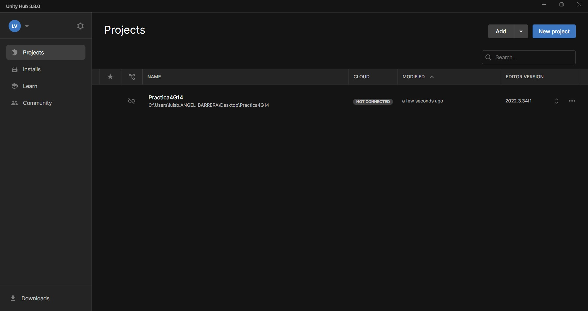
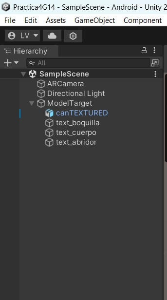
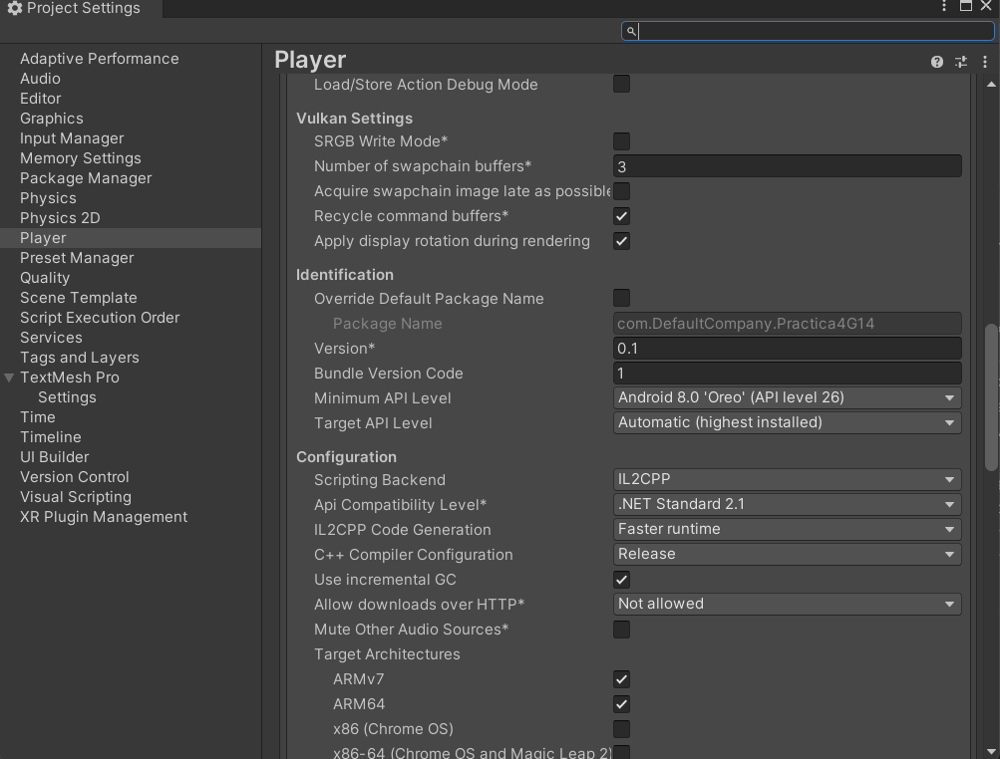
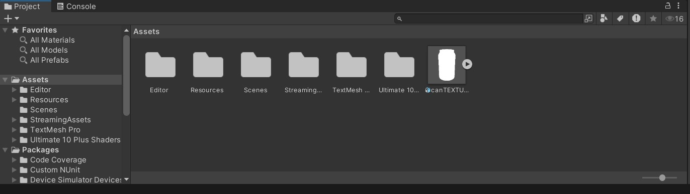

# Manual Tecnico  
#### Universidad de San Carlos de Guatemala  
#### Facultad de Ingeniería  
#### Inteligencia Artificial 1  

## Práctica 4   
### VUFORIA  

#### Nombre y carnet 
- Yeinny Melissa Catalán de León   - 202004725  
- Luis Angel Barrera Velásquez     - 202010223 

Guatemala, Junio 2024.  
___
  

# Creación de un Model Target de Vuforia

## Requisitos del Sistema

### Hardware
- PC con Windows 10 de 64 bits o macOS 10.15 o superior
- Procesador Intel Core i5 o superior
- 8 GB de RAM (se recomienda 16 GB)
- Tarjeta gráfica compatible con OpenGL 3.0 o superior

### Software
- Unity 2020.3.x o superior
- Vuforia Engine (se recomienda la última versión)
- Visual Studio 2019 o superior (para Windows)
- Xcode 12.0 o superior (para macOS)

## Descargas Necesarias

### Modelos 3D
- Modelos en formato .glb y .fbx (pueden ser descargados de sitios como Sketchfab, TurboSquid, etc.)

### Herramientas
- Unity Hub: [Descargar](https://unity3d.com/get-unity/download)
- Vuforia Engine SDK: [Descargar](https://developer.vuforia.com/downloads/sdk)
- Blender (opcional para convertir y ajustar modelos 3D): [Descargar](https://www.blender.org/download/)

## Paso a Paso para Crear un Model Target en Vuforia

### 1. Configuración del Proyecto

1. **Instalar Unity Hub**: Descarga e instala Unity Hub desde el sitio oficial.
2. **Crear un Nuevo Proyecto en Unity**:
   - Abre Unity Hub y crea un nuevo proyecto.
   - Selecciona la plantilla “3D” y da un nombre a tu proyecto.
3. **Instalar el SDK de Vuforia**:
   - Abre el proyecto en Unity.
   - Ve a `Window > Package Manager`.
   - En la lista desplegable, selecciona “My Assets” y busca “Vuforia Engine”.
   - Instala el paquete de Vuforia.

### 2. Configuración de Vuforia en Unity

1. **Activar Vuforia en el Proyecto**:
   - Ve a `File > Build Settings`.
   - Selecciona la plataforma de tu preferencia (iOS o Android) y haz clic en “Switch Platform”.
   - Marca la casilla “Vuforia Augmented Reality Supported” en `Player Settings > XR Settings`.

### 3. Creación del Model Target

1. **Importar el Modelo 3D**:
   - Descarga el modelo 3D en formato .glb o .fbx.
   - Arrastra y suelta el archivo del modelo en la carpeta “Assets” en Unity.
2. **Configurar el Model Target**:
   - Ve a `GameObject > Vuforia Engine > Model Targets`.
   - Selecciona el archivo del modelo 3D que importaste.
   - Ajusta el tamaño y la posición del modelo según sea necesario.

### 4. Configuración de la Vista 360 Grados

1. **Crear una Cámara 360 Grados**:
   - Ve a `GameObject > Camera` para agregar una nueva cámara.
   - Coloca la cámara en el centro del modelo 3D y ajusta el campo de visión para cubrir todo el modelo.
2. **Configurar el Seguimiento de la Cámara**:
   - Añade un componente de “Trackable Event Handler” al objeto del Model Target.
   - Configura el comportamiento deseado para cuando el modelo sea detectado.

### 5. Prueba y Publicación

1. **Prueba en el Editor**:
   - Usa el modo Play en Unity para probar el reconocimiento y seguimiento del modelo.
2. **Construcción y Prueba en Dispositivo**:
   - Configura las opciones de construcción en `File > Build Settings`.
   - Conecta tu dispositivo y realiza la construcción.
   - Prueba la aplicación en tu dispositivo para asegurarte de que el Model Target funciona correctamente.

---

# Configuracion detallada de Unity

# Documentación del Proyecto en Unity 3D

## Creación del Proyecto

Para comenzar, se debe crear un proyecto en Unity 3D. A continuación se muestra una captura de pantalla del proyecto recién creado:

## Componentes Utilizados

En este proyecto, se han utilizado varios componentes importantes:

1. **ARCamera**: Este componente es crucial en proyectos de Realidad Aumentada (AR). ARCamera reemplaza la cámara principal y gestiona la captura y el procesamiento de la imagen real, combinándola con los elementos virtuales que se quieran mostrar en la pantalla.

2. **Directional Light**: Este componente simula una luz direccional, similar a la luz del sol. Es útil para iluminar toda la escena de manera uniforme y puede ajustarse en términos de intensidad y dirección.

3. **Model Target**: Dentro de este componente se guarda el modelo 3D (.fbx) y los textos que se extraen del modelo en 3D. Es una herramienta de Vuforia que permite reconocer y rastrear modelos 3D específicos en el entorno real.

### Detalles de los Modelos y Textos

- **Modelo 3D (.fbx)**: Se importa y se utiliza como objetivo de reconocimiento en AR.
- **Textos**: Los textos se sacan del modelo en 3D y se colocan en la jerarquía para mostrarse cuando se reconoce el modelo.

## Configuraciones del Proyecto

En la configuración del proyecto, es importante realizar los siguientes ajustes:

1. **Minimum API Level**: Cambiar a Android 8.0 (API Level 26).
2. **Scripting Backend**: Seleccionar IL2CPP.
3. **Target Architectures**: Marcar ARM64.

A continuación se muestra la configuración detallada:

## Importación y Decoración de Modelos

Además, se debe importar el archivo .glb en la carpeta de Assets arrastrando y soltando el archivo. Para la decoración y reconocimiento del Model Target, se utilizó un pack de texturas disponible en el siguiente enlace:

[Ultimate 10+ S Textures Pack](https://assetstore.unity.com/?q=ultimate%2010%2B%20s&orderBy=1)

---
## Consejos Adicionales

- **Optimización de Modelos 3D**: Usa herramientas como Blender para reducir la cantidad de polígonos y optimizar el rendimiento.
- **Materiales y Texturas**: Asegúrate de que los materiales y texturas estén correctamente aplicados para mejorar el reconocimiento del Model Target.
- **Documentación**: Consulta la [documentación oficial de Vuforia](https://library.vuforia.com/) para obtener más detalles y soporte.

---