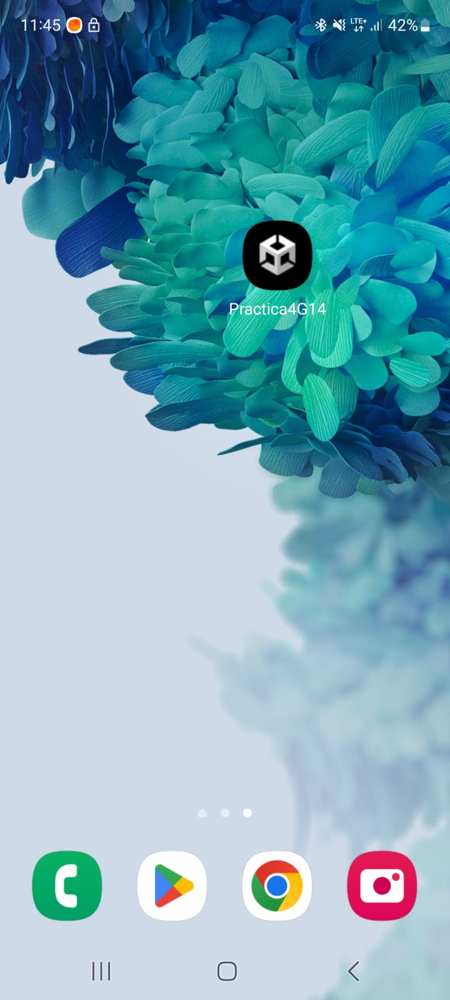
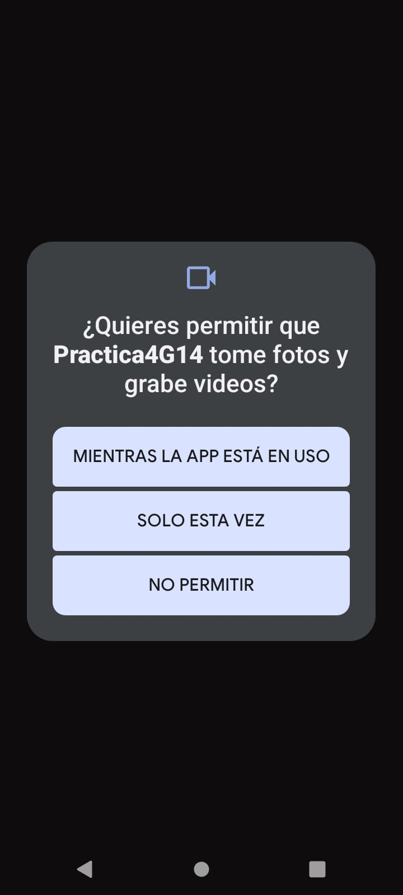
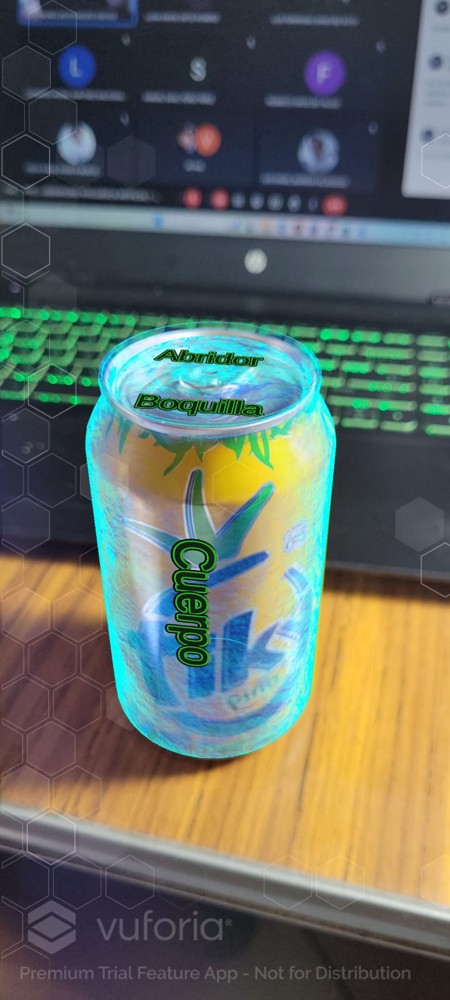

# Manual de Usuario  
#### Universidad de San Carlos de Guatemala  
#### Facultad de Ingeniería  
#### Inteligencia Artificial 1  

## Práctica 4   
### VUFORIA  

#### Nombre y carnet 
- Yeinny Melissa Catalán de León   - 202004725  
- Luis Angel Barrera Velásquez     - 202010223 

Guatemala, Junio 2024.  
___
  
## Introducción  
___
Este manual de usuario tiene la finalidad de dar a conocer a todos los usuarios que hagan uso del software las funcionalidades y pasos a seguir para que puedan usarlo de forma óptima. Para cumplir con esta finalidad se incluye la descripción de las pantallas con las que se encontrará el usuario, para que pueda tener mejor interacción con la interfaz.  
  
La aplicación tiene como objetivo la visualización en realidad aumentada de una lata.  
  
## Objetivos  
___
### General  
- Proporcionar al usuario que utilice el software, una guía en la cual basarse par el manejo adecuado de la aplicación y de esta manera lograr un uso adecuado y optimo de dicha aplicación.  
 
### Específicos  
- Dar al usuario, por medio de una manera gráfica y fácil de entender, toda la información necesaria para poder comprender el funcionamiento lógico de la aplicación.  

- Explicar al usuario las indicaciones y pasos necesarios para que pueda realizar la simulación de la forma correcta.  

## Alcances del Sistema  
___
Este sistema va dirigido para los usuarios que quieran empezar en al ámbito de la realidad aumentada y visualizar las partes de una lata.  

## Requisitos del Sistema  
___
- **Sistema Operativo:** Android.  

## Interfaz Gráfica y Flujo de la aplicación
___
### Instalación de la aplicación

Para instalar la aplicación puede descargar el archivo desde [aquí](https://drive.google.com/drive/folders/1JI1xkmr2XjzAuKmDawv0yBNvihgYRjO9?usp=sharing) y al descargarlo presionar la opción para iniciar la instalación.  

### Visualización de la aplicación en el telefono  
  

Una vez instalada la aplicación se podrá visualizar en el teléfono con el ícono que se muestra en la imagen.  

### Abriendo la aplicación por primera vez  
  

Al abrir la aplicación por primera vez se podrá visualizar un mensaje como el de la imagen para darle a la aplicación acceso a la cámara, está operación se debe permitir obligatoriamente para poder escanear el objeto.  

### Uso de la realidad aumentada en la lata  
 

Ya en la aplicación bastaría con enfocar la lata con el teléfono a una distancia apropiada para que la aplicación pueda detectarla, además se debe contar con buena iluminación. Así se estaría visualizando algo parecido a lo de la imagen marcando las partes: abridor, boquilla y cuerpo.   

## Conclusión
___
Este manual ha guiado el desarrollo de una aplicación de realidad aumentada utilizando Unity y Vuforia, centrada en el reconocimiento y detalle de una lata. La aplicación final permite a los usuarios identificar y explorar objetos a través de la cámara de su teléfono, demostrando cómo esta tecnología puede ayudar en las experiencias educativas y prácticas en laboratorios y entornos educativos.